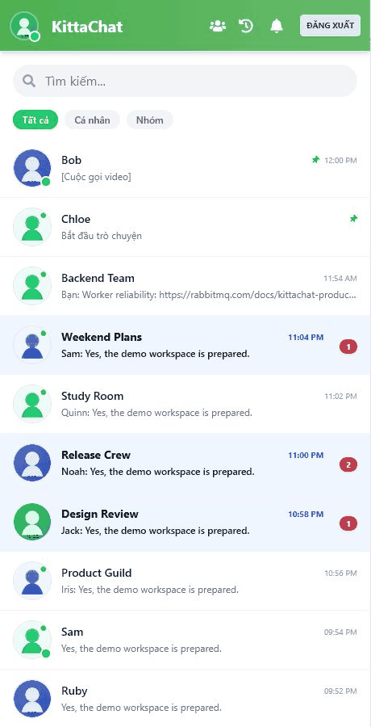
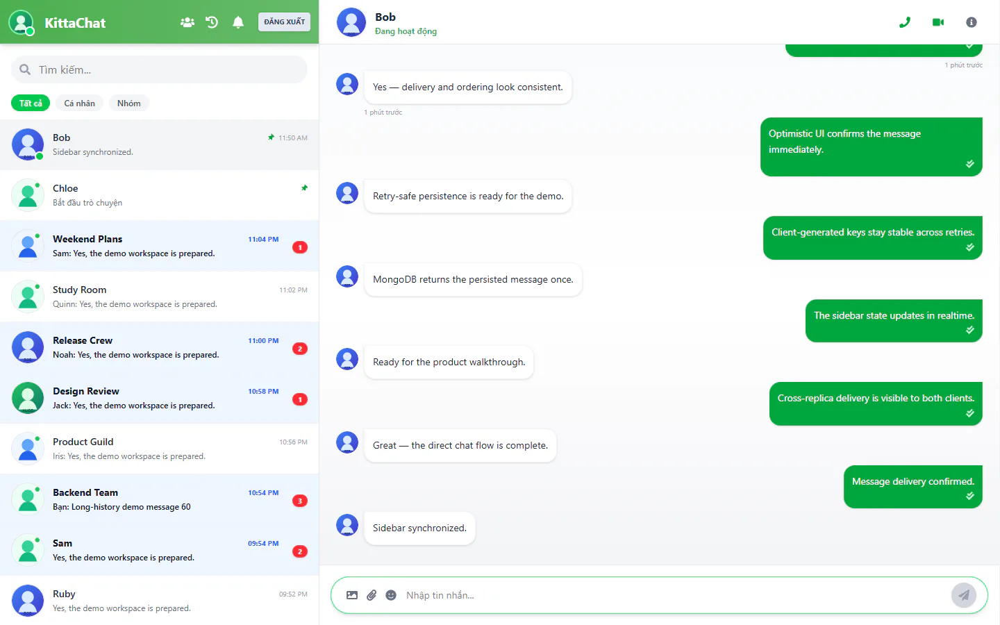
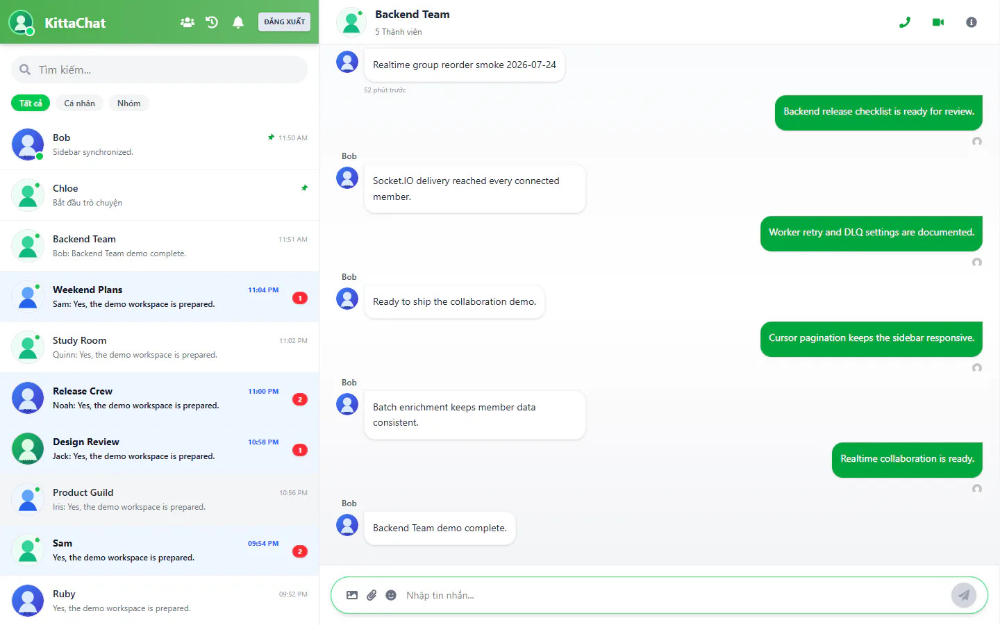
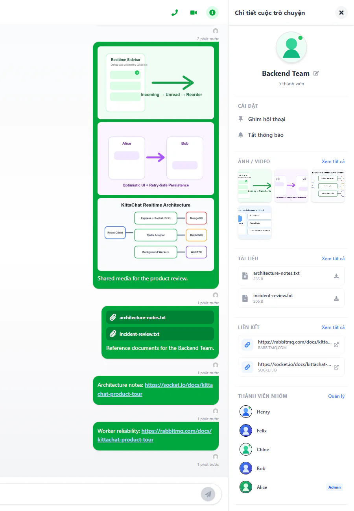
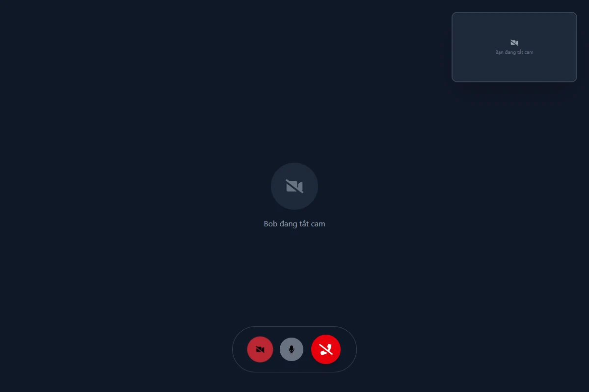
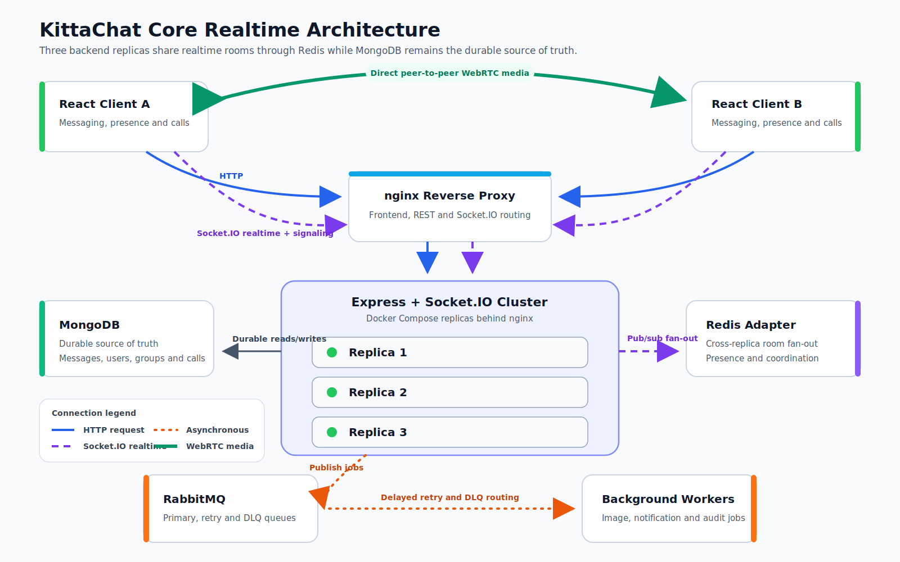

<p align="center">
  
</p>

# KittaChat

[](https://github.com/NhiBuaa/kitta-chat/actions/workflows/tests.yml)
[](https://github.com/NhiBuaa/kitta-chat/actions/workflows/build.yml)

KittaChat is a full-stack realtime communication platform for direct messaging, group collaboration, file sharing, presence, and WebRTC audio/video calls.

Built as a production-oriented engineering project focused on scalable realtime systems, event-driven architecture, and distributed backend design.

## Watch the Demo

> **Recorded walkthrough in preparation.** A 2–3 minute English-narrated product demo will be published on Google Drive after final capture and anonymous-viewer verification.

KittaChat does not currently advertise a hosted public environment. Until the recording is published, the verified Docker Compose workflow below provides the complete local product experience. This section intentionally contains no placeholder or unverified demo URL.

## Product Tour

### Realtime Sidebar

<p align="center">
  
</p>

<p align="center"><em>Incoming messages update unread state and reorder conversations in realtime.</em></p>

<table>
  <tr>
    <td width="50%" valign="top">
      <strong>Direct Chat</strong><br /><br />
      <br /><br />
      <em>Optimistic direct messaging with retry-safe persistence and realtime delivery.</em>
    </td>
    <td width="50%" valign="top">
      <strong>Group Chat</strong><br /><br />
      <br /><br />
      <em>Group collaboration preserves sender identity and synchronizes updates across members.</em>
    </td>
  </tr>
</table>

### Conversation Information Panel

<p align="center">
  
</p>

<p align="center"><em>Shared media, files and links use focused explorers with cursor-based pagination and freshness indicators.</em></p>

### WebRTC Audio/Video Call

<p align="center">
  
</p>

<p align="center"><em>WebRTC peer-to-peer media with Socket.IO signaling and durable call history.</em></p>

## Engineering Highlights

### 1. Cross-Replica Realtime Delivery

**Problem.** A client connected to one backend replica must reach users whose sockets are attached to another replica.

**Design.** Docker Compose runs three Express + Socket.IO replicas behind nginx. The Redis Adapter distributes room events across processes while MongoDB remains the durable source of truth; Redis is limited to fan-out, presence, cache and short-lived coordination.

**Evidence.** [Design Doc](docs/SOCKET_IO_SCALING.md) · [Runtime Topology](docker-compose.yml) · [Adapter Source](server/src/socket/index.js) · [Readiness Tests](server/test/socketInitReadiness.test.js)

### 2. Retry-Safe Message Persistence

**Problem.** Network retries can submit the same optimistic message more than once.

**Design.** The client preserves a generated idempotency key across retries. MongoDB upserts by `(sender, idempotencyKey)` under a partial unique index, returns the existing message for duplicate attempts and prevents repeated background publication after a confirmed duplicate persistence result.

**Evidence.** [Engineering Notes](docs/INTERVIEW_NOTES.md) · [Message Model](server/src/models/Message.js) · [Persistence Source](server/src/utils/saveMessageInBackground.js) · [Persistence Tests](server/test/saveMessageInBackground.test.js) · [Side-Effect Tests](server/test/messageCreatedJobs.test.js)

### 3. MongoDB-Gated Call Finalization

**Problem.** Reject, timeout, disconnect and explicit end events can race across backend processes and create conflicting terminal states or duplicate call logs.

**Design.** The main termination paths share a conditional MongoDB update that permits one finalization result. Redis coordination improves cross-replica routing, while emergency fallbacks remain deliberately outside the absolute guarantee.

**Evidence.** [Architecture Design](docs/ARCHITECTURE.md) · [Call PRD](specs/done/audio-video-calls.md) · [Finalizer Source](server/src/socket/handlers/call/services/callFinalizer.js) · [Finalizer Tests](server/test/callFinalizer.test.js) · [Termination Tests](server/test/endCallFinalizer.test.js)

### 4. Scalable Conversation Sidebar

**Problem.** Direct and group conversations need one stable timeline while unread state, filters and realtime updates continue changing.

**Design.** A unified read model uses cursor pagination with `lastMessageAt` plus an ObjectId tie-breaker. Backend batch enrichment avoids per-item N+1 lookups, while the client keeps filter-specific pagination state and reorders conversations on incoming events.

**Evidence.** [ADR-006](docs/adr/006-unified-sidebar-conversations.md) · [Sidebar PRD](specs/done/unified-sidebar-conversations.md) · [Controller Source](server/src/controllers/sidebarController.js) · [Integration Tests](server/test/sidebarConversations.integration.test.js) · [Client State Tests](client/src/features/chat/hooks/useSidebarState.test.js)

### 5. Resilient Background Job Processing

**Problem.** Image, notification and audit side effects must survive transient failures without blocking realtime chat or call decisions.

**Design.** RabbitMQ uses durable primary, retry and dead-letter queues with delayed redelivery, bounded attempts and poison-message routing. Correlation identifiers propagate from producers through workers so failures can be traced without placing RabbitMQ on the synchronous messaging path.

**Evidence.** [Worker Design](docs/RABBITMQ_WORKER_FLOWS.md) · [Queue Topology](server/src/queues/topology.js) · [Correlation Source](server/src/queues/correlation.js) · [Infrastructure Tests](server/test/rabbitmqInfrastructure.test.js) · [Worker Tests](server/test/notificationWorker.test.js)

## Architecture



Socket.IO carries signaling and application events; audio/video media flows directly between WebRTC peers. RabbitMQ handles background side effects only and does not decide realtime message delivery or call lifecycle state.

### Optional External Integrations

- **AWS S3 + CloudFront** — media storage and delivery.
- **SMTP** — email notifications.
- **Firebase Cloud Messaging** — push notifications.

These providers are intentionally excluded from the core diagram so the realtime topology remains readable in 10–15 seconds.

## Quick Start

### Docker Compose Source of Truth

Prerequisites: Docker with Compose, Node.js 22 and npm.

1. Prepare the local server environment without committing it:

   ```bash
   cp server/.env.example server/.env
   # PowerShell: Copy-Item server/.env.example server/.env
   ```

2. Start and build the complete stack:

   ```bash
   docker compose up -d --build
   ```

3. Seed the reviewer-safe demo dataset:

   ```bash
   npm run seed:demo
   ```

Open `http://localhost`. The stack includes nginx, three backend replicas, MongoDB, Redis, RabbitMQ and the image, notification and audit workers.

### Prefer a one-command setup?

```bash
npm run demo
```

The convenience command creates `server/.env` only when it is absent, generates local-only secrets without printing them, never overwrites an existing environment file, starts Docker Compose, waits for readiness and runs the same idempotent demo seed.

Stop the stack with:

```bash
docker compose down
```

## Demo Accounts

The default seed creates neutral identities under the reserved `.test` namespace:

| User | Email | Password | Suggested use |
| --- | --- | --- | --- |
| Alice | `alice@kittachat.test` | `KittaChatDemo!2026` | Primary window; sidebar, panel and outgoing actions. |
| Bob | `bob@kittachat.test` | `KittaChatDemo!2026` | Second window; incoming messages and call acceptance. |

The dataset creates at least 20 conversations (24 by default), six groups, shared resources and dedicated empty, media-only, files-only, links-only and long-history conversations. Re-running the seed upserts demo identities and deterministic records without duplicating messages or deleting data outside the demo namespace. Remote MongoDB targets are rejected by default.

See [Demo Dataset Source](server/src/demo/demoDataset.js), [Seed Safety](server/src/demo/demoSeedSafety.js) and [Seed Tests](server/test/demoSeedService.test.js) for implementation evidence.

## Testing

Run the same source-of-truth commands used by CI:

```bash
cd server
npm ci
npm test
```

```bash
cd client
npm ci
npm test
npm run build
```

GitHub Actions separates verification by responsibility:

- [Tests workflow](.github/workflows/tests.yml) runs the complete server and client test scripts.
- [Build workflow](.github/workflows/build.yml) verifies the client production build independently.

The badges in the Hero read directly from these workflows; no passing state or test count is maintained manually. Multi-client behavior is additionally checked through the [Docker Compose smoke guide](docs/DEPLOYMENT_AND_SMOKE_TESTS.md).

## Known Limitations

1. **No hosted public environment** — The product demo will be provided through a recorded walkthrough; the complete product is currently available through the reproducible local Docker Compose setup.
2. **Deployment focuses on local reproducibility** — The project demonstrates horizontal scaling with Docker Compose. Production orchestration, for example Kubernetes, is intentionally outside the current scope.
3. **Optional providers require configuration** — AWS S3/CloudFront, SMTP and Firebase integrations require reviewer-provided credentials to run end-to-end.
4. **Production observability has a focused scope** — The current stack provides health, readiness and operational endpoints plus application logs; a full metrics and distributed tracing stack is a future extension.
5. **Verification is layered but not browser-E2E automated** — Current verification focuses on unit tests, integration tests, production builds and multi-client manual smoke testing. Automated browser E2E testing is planned for a future iteration.

## Technical Documentation

- [Architecture Overview](docs/ARCHITECTURE.md) — ownership boundaries for MongoDB, Redis, RabbitMQ and Socket.IO.
- [REST API Reference](docs/API.md) — authentication, request contracts and endpoint examples.
- [Socket.IO Multi-Replica Scaling](docs/SOCKET_IO_SCALING.md) — rooms, Redis Adapter fan-out, reconnect behavior and operational proof.
- [RabbitMQ Worker Flows](docs/RABBITMQ_WORKER_FLOWS.md) — queue topology, retry, DLQ, poison-message and correlation behavior.
- [Deployment and Smoke Tests](docs/DEPLOYMENT_AND_SMOKE_TESTS.md) — Compose startup, health checks and multi-client verification.
- [Recruiter README PRD](specs/active/recruiter-facing-readme.md) — approved narrative, claim boundaries and delivery plan.
- [ADR-005: Conversation Panel Two-Stage Loading](docs/adr/005-conversation-panel-two-stage-loading.md) — metadata-first loading and resource explorers.
- [ADR-006: Unified Sidebar Conversations](docs/adr/006-unified-sidebar-conversations.md) — cursor pagination, filtering, enrichment and realtime state.
- [Interview Notes](docs/INTERVIEW_NOTES.md) — trade-offs, reliability lessons and CV-safe claims.
