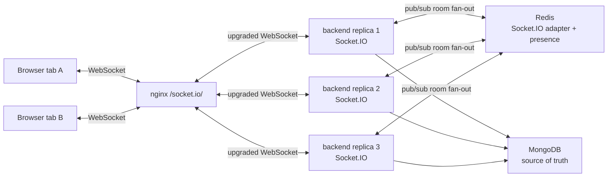
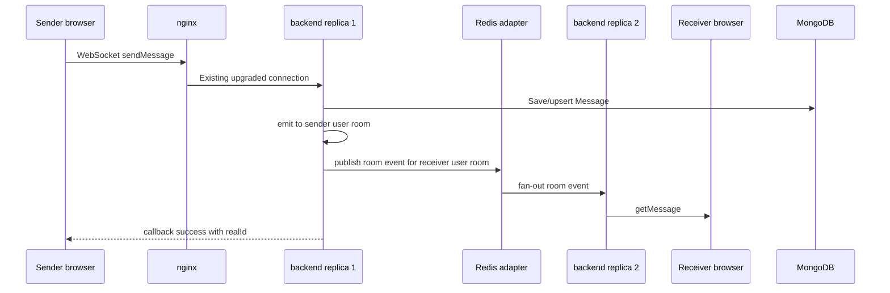

# Socket.IO Multi-Replica Scaling

This document explains how realtime delivery works when Docker Compose runs
three backend replicas behind nginx.

The short answer: each WebSocket connection is attached to one backend process,
but all backend processes share Socket.IO room events through the Redis adapter.
MongoDB remains the durable source of truth. Redis is used for fan-out,
presence, cache, and short-lived coordination, and can be rebuilt from MongoDB
or live socket state where the code supports fallback.

## Runtime Topology

Docker Compose runs:

- `nginx`: reverse proxy for `/api/` and `/socket.io/`.
- `backend`: 3 Express + Socket.IO replicas.
- `redis`: Socket.IO adapter pub/sub, presence, cache, and coordination keys.
- `mongo`: durable source of truth.
- `rabbitmq` and workers: background side-effect processing only.

RabbitMQ is not used for realtime chat, typing, presence, or call signaling.



## Client Connection Flow

The client socket lifecycle is in
`client/src/services/socket/SocketProvider.jsx`.

1. The provider reads `user` and `token` from `localStorage`.
2. If no user or token exists, it does not create a socket.
3. It connects to `VITE_API_URL` / `SERVER_URL` with:
   - `transports: ["websocket"]`
   - `auth: { token }`
   - infinite reconnection attempts
   - reconnect delay from 1s to 30s
4. On `connect`, the client emits `addNewUser` with its `userId`.
5. If `last_message_id` exists, the client calls the REST missed-message sync
   endpoint to recover messages missed during disconnect.
6. The client sends a `heartbeat` socket event every 20 seconds while connected.
7. On unmount/logout, it disconnects the socket and clears heartbeat/listener
   timers.

The client intentionally uses WebSocket-only transport. There is no long-polling
fallback in the current configuration.

## Socket Authentication

Socket authentication happens before the connection handler runs in
`server/src/socket/index.js`.

1. The server reads `socket.handshake.auth.token`.
2. Missing token rejects the connection with `Authentication required`.
3. Invalid or expired JWT rejects the connection with `Invalid or expired token`.
4. Valid JWT sets:
   - `socket.userId`
   - `socket.userEmail` when present in the token
5. Only authenticated sockets register presence, message, friend, typing, and
   call handlers.

The later `addNewUser` event is also checked against the authenticated
`socket.userId`. A socket cannot join another user's room by sending a different
`userId`.

## User Rooms And Group Rooms

Room joining happens mainly in `server/src/socket/handlers/presenceHandler.js`.

### User Room

After `addNewUser`, the server joins the socket to a room named by the
authenticated user id:

```text
room: <userId>
```

Direct chat, call, friend, file, and avatar events can target this room. If the
same user has multiple tabs/devices, all socket ids for that user can receive
events through the same user room.

### Group Rooms

On initial registration, the server queries MongoDB for groups where the user is
a member and joins each group room:

```text
room: <groupId>
```

The explicit `joinGroup` event also verifies membership with MongoDB before
joining a group room. `leaveGroup` removes the socket from that group room.

Group messages emit to the group conversation room, which is the group `_id`.

## Redis Adapter Fan-Out Across Replicas

Each backend replica creates two Redis clients in `server/src/socket/index.js`:

- publisher client
- subscriber client

The server installs `@socket.io/redis-adapter` with those clients before it
accepts socket traffic. If Redis adapter connection fails at startup, socket
initialization fails fast.

When replica 1 emits to a room:

```js
io.to(roomId).emit(eventName, payload)
```

Socket.IO delivers the event to local sockets on replica 1 and publishes the
room event through Redis. Replicas 2 and 3 receive the adapter message and
deliver it to their local sockets that are also in that room.

This is how a sender connected to one backend replica can send a message to a
receiver whose browser is connected to a different backend replica.

## Direct Message Delivery Across 3 Replicas



For direct messages, `messageHandler` emits `getMessage` to both:

- receiver user room
- sender user room

For group messages, it emits `getMessage` to the group room.

The MongoDB `Message` document is saved before the realtime emit is considered
successful. If the client later reconnects and suspects it missed a realtime
event, it can call the REST sync endpoint using `last_message_id`.

## Presence, Heartbeat, Reconnect, And Offline Grace

Presence is a Redis + Mongo write-through flow.

### First Online Connection

When `addNewUser` succeeds:

1. The socket joins the user room and group rooms.
2. The server deletes `offline_timer:<userId>` to cancel a pending offline
   transition from a refresh/reconnect.
3. The server adds `socket.id` to `user_sockets:<userId>`.
4. If this is the user's first active socket:
   - update presence in MongoDB and Redis through `setPresenceWriteThrough`
   - add the user to `global_online_users`
   - broadcast `userStatusChanged` to friends and group rooms
5. If this is an additional tab/device, only heartbeat TTL is renewed.

### Heartbeat

The client emits `heartbeat` every 20 seconds. The server renews Redis presence
TTL through `renewHeartbeat`. Heartbeat intentionally does not write MongoDB on
every tick.

### Disconnect And Offline Grace

On socket disconnect:

1. The server removes the socket id from `user_sockets:<userId>`.
2. If other sockets remain for the same user, the user stays online.
3. If no sockets remain, the server sets `offline_timer:<userId>` for 5 seconds.
4. After roughly 5.5 seconds, the server checks:
   - is the offline timer gone?
   - is `user_sockets:<userId>` still empty?
5. Only then does it write offline presence to MongoDB/Redis, remove the user
   from `global_online_users`, and broadcast offline status.

This grace period prevents online/offline flicker during refreshes and short
reconnects.

## MongoDB And Redis Responsibilities

MongoDB remains authoritative for durable state:

- users and friendships
- groups and membership
- messages and call log messages
- call histories
- uploaded file metadata

Redis is used for:

- Socket.IO adapter fan-out across replicas
- presence hash/TTL
- `user_sockets:<userId>` multi-tab socket tracking
- `offline_timer:<userId>` grace-period marker
- `global_online_users` legacy/online-friends support
- cache-aside and write-through user/friend/conversation caches
- short-lived call coordination keys

Redis improves realtime coordination and performance, but the app should not
depend on Redis as the durable source of truth for messages, users, groups, or
call histories.

## Operational Proof Points

The server emits diagnostic logs that help prove multi-replica delivery:

- Socket auth/connect logs include `NODE_NAME`, user id, and socket id.
- Direct message send logs include sender, receiver, conversation id, and node.
- `proof:message-dispatched` server-side events log which backend replica holds
  local receiver sockets after Redis adapter fan-out.

Useful commands:

```powershell
docker compose logs -f backend
docker compose logs -f nginx
docker compose logs -f redis
```

Manual smoke flow:

1. Start the full stack with `docker compose up -d --build`.
2. Open two browsers or profiles and log in as two users.
3. Send a direct message from user A to user B.
4. Watch backend logs for send and delivery proof logs across backend replicas.
5. Refresh one browser and confirm the user does not flicker offline immediately.
6. Disconnect all tabs for a user and confirm offline status appears after the
   grace period.

## Limitations And Honest Claims

- The project uses WebSocket-only transport; long-polling fallback is not part
  of the current design.
- Redis adapter is a core socket dependency at startup. If Redis adapter
  connection fails, Socket.IO initialization fails.
- `/healthz` currently reports cache Redis status, but does not separately prove
  every Socket.IO adapter pub/sub client after startup.
- RabbitMQ does not back realtime delivery. It is only for background side
  effects such as image processing, notification email, and audit jobs.
- Realtime events are still best-effort network delivery. MongoDB persistence
  plus REST missed-message sync provide recovery for chat messages.
- Presence is optimized for practical UX, not a formal distributed consensus
  system. The 5-second grace period reduces flicker but does not guarantee exact
  offline timestamps under all network failures.
