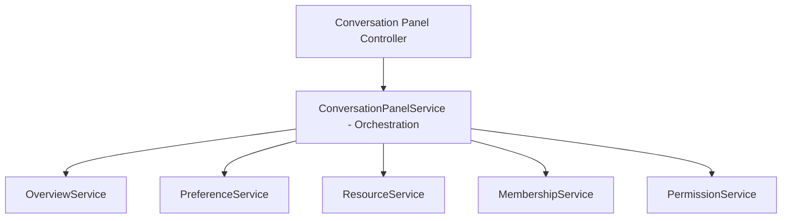
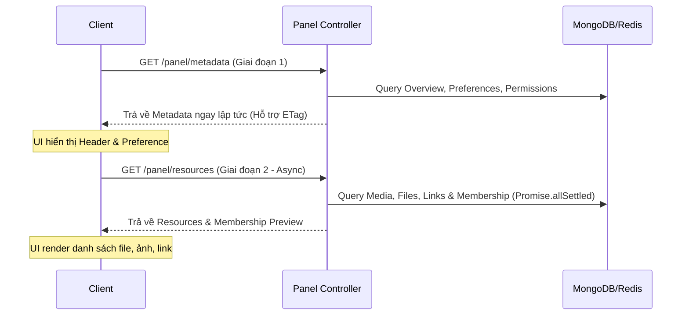

# Product Requirement Document (PRD) — Conversation Information Panel

## 1. Problem Statement
Khi người dùng tương tác trong cuộc hội thoại (Direct hoặc Group), họ cần xem nhanh thông tin tổng quan và các tài nguyên đã chia sẻ. Để đảm bảo tốc độ phản hồi gần như tức thì và khả năng scale trên hệ thống có hàng triệu message, tính năng này được thiết kế theo hướng **Domain-Driven**, tối ưu hóa việc phân tách API thành hai giai đoạn (Metadata & Resources), tận dụng **Conversation Read Model** để phân quyền hiển thị, và áp dụng cơ chế batch-load cùng cấu trúc index tối ưu để loại bỏ N+1 queries.

---

## 2. Domain-Driven Design (Kiến trúc nghiệp vụ)

Hệ thống phân rã thành các Domain nghiệp vụ chuyên biệt. `ConversationPanelService` đóng vai trò **Orchestration Layer** mỏng, điều phối các domain service độc lập để xây dựng dữ liệu trả về:



### 2.1. Conversation Overview Domain (`OverviewService`)
* **Nhiệm vụ:** Cung cấp thông tin nhận dạng cơ bản và trạng thái của cuộc hội thoại.
* **Dữ liệu:**
  * Direct Chat: Avatar bạn bè, tên hiển thị, trạng thái online/offline (truy xuất trực tiếp từ `PresenceService` đọc từ Redis; Socket chỉ cập nhật trạng thái vào Redis).
  * Group Chat: Avatar nhóm, tên nhóm, số lượng thành viên thực tế (đọc trực tiếp từ `Conversation.memberCount` hoặc `Group.members.length` thay vì đếm chay trong DB).
* **Presence Fallback:** Nếu Presence Service gặp lỗi hoặc timeout khi truy vấn Redis, hệ thống sẽ tự động fallback trạng thái của user về `offline` để tránh làm chậm hoặc lỗi toàn bộ Metadata API.

### 2.2. Conversation Resource Domain (`ResourceService`)
* **Nhiệm vụ:** Trích xuất các tài nguyên đã chia sẻ. Gồm các hàm độc lập:
  * `loadMedia(conversationId, limit, cursor, visibilityFilter)`: Tải tối đa 6 media (ảnh/video) gần nhất.
  * `loadFiles(conversationId, limit, cursor, visibilityFilter)`: Tải tối đa 5 file tài liệu gần nhất.
  * `loadLinks(conversationId, limit, cursor, visibilityFilter)`: Tải tối đa 5 liên kết URL gần nhất được trích xuất từ tin nhắn text.
* **Sorting (Sắp xếp):** Định nghĩa thứ tự sắp xếp chuẩn (Canonical ordering) là **newest Message._id first** (sắp xếp theo `Message._id` giảm dần).
* **Response Payload Boundary (Ranh giới dữ liệu phản hồi):** Để giới hạn response size và đảm bảo hiệu năng tải, Preview API chỉ trả về các metadata tối thiểu cần thiết để render UI, tuyệt đối không trả về dữ liệu nhị phân (binary), dữ liệu mã hóa base64 hoặc nội dung thô của file:
  * **Media (Ảnh/Video):** Chỉ trả về thumbnail URL, original URL (nếu cần), mimeType, width, height, size và các metadata nhận dạng cơ bản.
  * **File (Tài liệu):** Chỉ trả về metadata định danh (id, filename, mimeType, size, createdAt...).
  * **Link (Liên kết):** Chỉ trả về url, hostname và các metadata hiển thị (như title, description thu thập được).
* **Tối ưu hóa Database Schema cho Shared Links:**
  * Schema của `Message` được mở rộng thêm hai trường mới:
    * `hasLink: { type: Boolean, default: false }`
    * `links: [{ url: String, hostname: String }]`
  * Khi tin nhắn mới được tạo ở backend, nó được tiền xử lý: phát hiện URL bằng Regex cơ bản, sau đó sử dụng **Node.js URL Parser (`new URL()`)** để phân tích và chuẩn hóa cấu trúc URL, đảm bảo trích xuất chính xác `hostname` đã được chuyển thành chữ thường (`hostname.toLowerCase()`) để thống nhất định dạng (ví dụ: `https://www.Google.com/` -> `google.com`).
  * **Xử lý lỗi:** Các URL không hợp lệ khiến URL parser ném ngoại lệ sẽ được **bỏ qua và không làm gián đoạn luồng lưu trữ tin nhắn (skipped and do not fail message persistence)**.
  * Chỉ mục tối ưu: `{ conversationId: 1, hasLink: 1, _id: -1 }`.
* **Tối ưu hóa Shared Media/Files Index:**
  * Chỉ mục tối ưu trên `Message`: `{ conversationId: 1, type: 1, _id: -1 }`. Sắp xếp và phân trang theo `_id` giảm dần.

### 2.3. Conversation Membership Domain (`MembershipService`)
* **Nhiệm vụ:** Quản lý mối quan hệ thành viên.
  * `loadCommonGroups(userA, userB)`: (Direct chat) Lấy danh sách nhóm chat chung giữa 2 người dùng. Áp dụng Redis cache 5 phút (Cache-Aside Pattern).
    * **Cache Key:** Để tránh trùng lặp cache giữa hai chiều A-B và B-A, key được chuẩn hóa theo quy tắc: `commonGroups:min(userA, userB):max(userA, userB)`.
    * **Cache Invalidation:** Xóa cache khi có *bất kỳ sự kiện thay đổi nhóm nào (membership mutation events)* bao gồm tham gia, rời đi, bị kick, mời lại, xóa nhóm hoặc khôi phục nhóm.
  * `loadGroupMembers(groupId, limit, cursor)`: (Group chat) Lấy danh sách thành viên nhóm. Đối với các nhóm chat quy mô lớn, chỉ trả về preview tối đa 20 members gần nhất kèm theo cờ `hasMoreMembers` và cursor tiếp theo `nextMemberCursor` để đảm bảo API đồng nhất.
    * **Cursor chuẩn hóa:** Sử dụng chính xác một loại cursor duy nhất là `ConversationParticipant._id` cho cả Membership Preview và trang xem chi tiết (View All). Cả hai đều sử dụng chung ngữ nghĩa phân trang giống hệt nhau (identical pagination semantics) dựa trên chỉ mục `ConversationParticipant._id`.
  * **Sự thống nhất về sắp xếp:** Sắp xếp danh sách thành viên trong preview phải **đồng nhất (consistent)** với thứ tự sắp xếp được sử dụng bởi endpoint xem tất cả thành viên (View All).
* **View All:** Cung cấp API phân trang riêng để xem danh sách thành viên nhóm đầy đủ.

### 2.4. Conversation Preference Domain (`PreferenceService`)
* **Nhiệm vụ:** Quản lý ghim (`pinnedAt`), tắt thông báo (`mutedUntil`), custom tiêu đề (`customTitle`) từ `ConversationParticipant`.

### 2.5. Conversation Permission Domain (`PermissionService`)
* **Nhiệm vụ:** Trả về một Permission DTO chứa toàn bộ quyền thao tác của user hiện tại trên cuộc hội thoại.
  * **Thiết kế:** `PermissionService` phải **hoàn toàn tinh khiết (pure)**. Nó chỉ chịu trách nhiệm đánh giá phân quyền, tuyệt đối không thực hiện bất kỳ thao tác ghi (write operations) hay thay đổi dữ liệu nào.
* **Thời gian tài nguyên (Temporal Boundary):** Sử dụng helper `buildMessageVisibilityFilter(participant)` để lọc các tài nguyên dựa trên thời gian tham gia/rời nhóm/xóa lịch sử (`leftAt`, `deletedAt`).

### 2.6. Conversation Action Domain
* **Nhiệm vụ:** Thực hiện các hành động: Archive, Delete for me, Leave group, Unfriend, Block.
* **Nguyên tắc:** Action Domain đóng vai trò **Orchestrator** điều phối các service nghiệp vụ sẵn có (như `GroupService`, `ConversationService`), tuyệt đối không tự triển khai lại business logic nội bộ.

---

## 3. API Specification & Two-Stage Loading

Hệ thống sử dụng **Two-stage loading** bất đồng bộ để tối ưu hóa Perceived Performance:



### 3.1. Giai đoạn 1 — Tải nhanh Metadata
* **API:** `GET /api/conversations/:id/panel/metadata`
* **Nhiệm vụ:** Trả về thông tin Header, Preferences và Permissions.
* **API Versioning & Versioning Policy:**
  * Tất cả các phản hồi từ API panel đều đi kèm với trường `"version": 1` trong response payload và HTTP Header `X-Panel-Version: 1` để đảm bảo khả năng tương thích ngược (backward compatibility).
  * **Chính sách Versioning (Versioning Policy):**
    * Chỉ tăng API Version (ví dụ từ 1 lên 2) khi response schema có những thay đổi phá vỡ tương thích (breaking change) như: xóa bỏ trường bắt buộc, thay đổi kiểu dữ liệu của trường đang tồn tại, hoặc thay đổi cấu trúc định dạng cha.
    * Việc bổ sung trường mới (new fields) theo hướng tương thích ngược (backward-compatible) sẽ **không làm tăng API Version**.
* **Caching (ETag) & ETag Invalidation Rules:**
  * Hỗ trợ cơ chế **ETag / Last-Modified** ở server-side để client có thể cache cục bộ, giảm tải database khi thông tin không thay đổi.
  * **ETag Invalidation Rules (Quy tắc invalid ETag):** ETag sẽ thay đổi và buộc client tải lại metadata khi xảy ra một trong các trường hợp sau:
    1. Metadata của cuộc hội thoại thay đổi (ví dụ: avatar nhóm, tên nhóm, memberCount thay đổi).
    2. Preference của ConversationParticipant thay đổi (ví dụ: customTitle, thay đổi trạng thái ghim `pinnedAt`, thay đổi trạng thái tắt thông báo `mutedUntil`).
    3. Snapshot quyền truy cập (Permission snapshot) thay đổi (ví dụ: quyền của thành viên bị thay đổi khi bị kick, rời nhóm hoặc block v.v. dẫn đến thay đổi DTO permission).
    4. *Lưu ý:* Trạng thái hoạt động online/offline (Presence) hoàn toàn không tham gia vào ETag calculation để tránh invalid cache metadata liên tục. Presence sẽ luôn được fetch như live data hoặc cập nhật realtime thông qua Socket.
* **Response Payload:**
  ```json
  {
    "version": 1,
    "overview": {
      "kind": "direct",
      "name": "Nguyen Van A",
      "avatar": "url_to_avatar",
      "isOnline": true,
      "memberCount": 2
    },
    "preference": {
      "isPinned": false,
      "isMuted": false,
      "mutedUntil": null
    },
    "permissions": {
      "canRead": true,
      "canWrite": true,
      "canLeave": true,
      "canArchive": true,
      "canDelete": true,
      "canMute": true,
      "canPin": true
    }
  }
  ```

### 3.2. Giai đoạn 2 — Tải bất đồng bộ Resources & Membership
* **API:** `GET /api/conversations/:id/panel/resources`
* **Nhiệm vụ:** **Controller** sử dụng `Promise.allSettled()` để gọi song song các domain loaders: `loadMedia()`, `loadFiles()`, `loadLinks()`, `loadMembership()`.
* **API Versioning:** Tương tự Metadata, endpoint Resources trả về trường `"version": 1` trong payload và HTTP Header `X-Panel-Version: 1`.
* **Quy tắc Timeout:** Mỗi loader độc lập có cấu hình **Timeout mặc định là 2 giây**. 
  * Đây là **timeout ở cấp độ ứng dụng (application-level timeout)**.
  * Nếu database driver bên dưới hỗ trợ cơ chế cancellation, hệ thống sẽ truyền `AbortSignal` (hoặc cancellation token tương đương) để chủ động dừng thao tác database.
  * Nếu không hỗ trợ, timeout này chỉ có tác dụng ngắt kết nối xử lý và trả về phản hồi lỗi sớm ở API response, không đảm bảo việc hủy câu truy vấn đang thực thi ngầm trong cơ sở dữ liệu.
* **Snapshot Consistency (Tính nhất quán của Snapshot):**
  * Nhằm tối ưu hóa độ trễ (latency) và khả năng mở rộng (scale) của hệ thống, Resources API hoạt động theo mô hình **eventual consistency** (nhất quán sau cùng).
  * Các loaders (`loadMedia`, `loadFiles`, `loadLinks`, `loadMembership`) khi chạy song song qua `Promise.allSettled()` được phép đọc dữ liệu ở các thời điểm hơi lệch nhau. 
  * Hệ thống tuyệt đối không yêu cầu tất cả các loaders phải cùng đọc từ một database snapshot hoặc một transaction snapshot duy nhất. View All vẫn đóng vai trò là nguồn dữ liệu chuẩn cuối cùng (source of truth).
* **Quy ước API Contract khi có lỗi (Promise.allSettled Fail Contract):**
  Khi một hoặc nhiều loaders bị lỗi hoặc timeout, API vẫn trả về mã `200 OK` nhưng trường tương ứng trong JSON response sẽ mang trạng thái lỗi cụ thể:
  ```json
  {
    "version": 1,
    "resourcesPreview": {
      "media": {
        "status": "success",
        "items": [...],
        "hasMore": true,
        "nextCursor": "60a7..."
      },
      "files": {
        "status": "error",
        "items": [],
        "hasMore": false,
        "nextCursor": null
      },
      "links": {
        "status": "success",
        "items": [...],
        "hasMore": false,
        "nextCursor": null
      }
    },
    "membership": {
      "status": "success",
      "commonGroups": [...],
      "membersPreview": [...],
      "hasMoreMembers": true,
      "nextMemberCursor": "60a9..."
    }
  }
  ```
  Nhờ contract này, Client Frontend có thể hiển thị chính xác trạng thái Loading / Error / Retry độc lập cho từng vùng tài nguyên.
  
* **Quy tắc Retry (Retry Behavior) & Retry Scope Standardization:**
  * Nút **Retry** trên UI khi click chỉ thực hiện nạp lại duy nhất domain tài nguyên bị lỗi bằng cách gọi endpoint `/panel/resources?scopes=<scope>` (scopes được truyền dưới dạng mảng hoặc phân tách bằng dấu phẩy).
  * **Danh sách Retry Scopes hợp lệ:**
    * `media`
    * `files`
    * `links`
    * `membership`
  * **Hành vi API:** Nếu client truyền scope không hợp lệ (ví dụ: `?scopes=invalid_scope`), API sẽ trả về lỗi **`400 Bad Request`**.
  * Các loaders đã tải thành công trước đó **tuyệt đối không được thực thi lại (must not be re-executed)**.
  * Metadata endpoint (Giai đoạn 1) **tuyệt đối không được load lại** khi đang retry resources.
  * Toàn bộ dữ liệu của các tài nguyên đã tải thành công từ trước phải được giữ nguyên (preserved) trên giao diện, không bị reset hoặc biến mất trong suốt quá trình retry.
* **Chiến lược Query không N+1:**
  * Query projection để lấy danh sách tin nhắn chứa file, gom mảng ID: `fileIds = messages.flatMap(m => m.attachments)`.
  * Thực hiện 1 truy vấn duy nhất `$in` trên collection `File` để lấy tất cả files liên quan.
  * Map kết quả trong bộ nhớ bằng cấu trúc `Map` (lookup O(1)) thay vì dùng các vòng lặp lồng nhau.
  * **Mục tiêu hiệu năng:** Số lượng database round-trips phải là hằng số (O(1)) không phụ thuộc vào số lượng tin nhắn (Message count) hay số lượng file.

---

## 4. Realtime Synchronization & Client State

* **Client State Management (`ResourceStore`):**
  * `messageCreated`: Khi nhận tin nhắn mới chứa tài nguyên, `ResourceStore` giải mã và prepend vào đầu mảng preview của panel.
  * `messageUpdated` / `messageDeleted`: Cập nhật hoặc xóa tài nguyên tương ứng khỏi store.
  * **Realtime Complexity Limitation:** Realtime update chỉ cập nhật mảng preview trên client; **không recalculate** các cờ `hasMore`, `nextCursor` hoặc `total`. Khi người dùng mở xem tất cả (View All), danh sách sẽ được làm mới từ API.
  * **Trạng thái nhất quán:** Client store là **eventually consistent** (nhất quán sau cùng). Giao diện xem tất cả (View All) luôn đóng vai trò là nguồn chân lý (source of truth).
* **AbortController (Hủy Request cũ):**
  * Khi người dùng click chuyển đổi giữa các cuộc hội thoại nhanh chóng, Frontend sử dụng `AbortController` để hủy ngay request đang tải dở của cuộc hội thoại trước, tránh tình trạng race condition làm đè dữ liệu sai lệch.
* **Cursor Invalidation (Độ ổn định phân trang):**
  * **Cursor là bất biến (immutable)**. Tin nhắn mới được gửi đến sau khi panel đã load sẽ chỉ xuất hiện trước mốc cursor hiện tại trên giao diện preview realtime (không ảnh hưởng đến danh sách phân trang phía sau). Phân trang cursor-based đảm bảo độ ổn định cao, không bị duplicate hay mất bản ghi khi có tin nhắn mới đẩy vào đồng thời.

---

## 5. Non-functional Requirements (Yêu cầu phi chức năng)
* **Metadata endpoint target:** P95 latency < 80 ms trên môi trường production benchmark.
* **Resources endpoint target:** P95 latency được xác định chi tiết theo deployment SLA.
* **Resource loaders execution:** Thực thi hoàn toàn bất đồng bộ và độc lập. Lỗi của một loader không được ảnh hưởng đến các loader còn lại.
* **Cursor pagination stability:** Đảm bảo tính ổn định của phân trang cursor dưới áp lực gửi tin nhắn đồng thời.
* **Read isolation:** Các thao tác đọc thông tin panel tuyệt đối không thay đổi (mutate) trạng thái domain.
* **Observability Requirements (Yêu cầu khả năng quan sát hệ thống):**
  * **Metrics thu thập:**
    * `conversation_panel_metadata_latency`: Đo độ trễ endpoint metadata.
    * `conversation_panel_resources_latency`: Đo độ trễ endpoint resources.
    * `conversation_panel_loader_duration`: Đo thời gian thực thi của từng loader con.
    * `conversation_panel_loader_timeout_total`: Đếm tổng số lần loader bị timeout.
    * `conversation_panel_loader_error_total`: Đếm tổng số lần loader bị lỗi.
    * `conversation_panel_retry_total`: Đếm tổng số lượt retry tài nguyên.
    * `conversation_panel_cache_hit_total`: Đếm số lần cache hit trên Redis (Common Groups).
    * `conversation_panel_cache_miss_total`: Đếm số lần cache miss trên Redis.
  * **Structured Logs (Nhật ký cấu trúc):** Mỗi request gọi tới Panel API bắt buộc phải log tối thiểu thông tin cấu trúc sau:
    * `requestId`, `conversationId`, `userId`, `endpoint`, `loaderName` (nếu là resources), `duration`, `timeout`, `status`.
  * **Distributed Tracing (Vết luồng phân tán):** Cấu hình phân vết độc lập cho các chặng xử lý:
    * Metadata endpoint, Resources endpoint, `loadMedia`, `loadFiles`, `loadLinks`, `loadMembership`.


---

## 6. Security & Error Handling

* **Rate Limiting:** Áp dụng Configurable Rate Limiter (mặc định 30 requests/phút cho cặp user-conversation, cấu hình qua biến môi trường `CONVERSATION_PANEL_RATE_LIMIT`) riêng cho endpoint `/panel/resources` để chống spam.
* **UX Error States:**
  * Từng vùng domain con có vùng xử lý lỗi riêng (Retry button độc lập) dựa trên trạng thái `status: "error"` trả về trong JSON.

---

## 7. Feature Flags
* **Feature Flag Behavior (Hành vi Feature Flag):**
  * Khi cờ `CONVERSATION_PANEL_ENABLED=false`:
    * **Frontend:** Phải ẩn hoàn toàn điểm truy cập (entry point) của Conversation Panel (ví dụ: không cho phép click vào avatar/header chat để mở panel).
    * **Backend:** Nếu client cố tình hoặc bằng cách nào đó gửi request tới các endpoints của panel (`/panel/metadata` hoặc `/panel/resources`), API sẽ lập tức từ chối và trả về HTTP status **`404 Not Found`**.
  * Khi cờ `CONVERSATION_PANEL_RESOURCES_ENABLED=false`:
    * Phần tài nguyên và danh sách thành viên sẽ bị tắt. Metadata endpoint hoạt động bình thường, nhưng Resources endpoint sẽ không thực thi các loaders con mà chỉ trả về cấu trúc rỗng hoặc status ẩn.

---

## 8. Architecture Invariants (Các luật kiến trúc bất biến)
Các nguyên tắc bất biến này bắt buộc phải được duy trì nghiêm ngặt trong toàn bộ vòng đời của tính năng và dự án để bảo đảm tính ổn định và khả năng mở rộng:

1. **Presence không tham gia ETag:** Trạng thái online/offline của Presence Service hoàn toàn loại trừ khỏi phép tính ETag của Metadata endpoint để ngăn chặn việc cache bị invalid liên tục.
2. **PermissionService chỉ đọc, không ghi:** `PermissionService` là pure service, chỉ chịu trách nhiệm đánh giá và trả về DTO quyền truy cập, tuyệt đối không chứa business logic thay đổi hoặc ghi dữ liệu.
3. **Resource loaders hoàn toàn độc lập:** Các loader tài nguyên (`loadMedia`, `loadFiles`, `loadLinks`) độc lập về cả logic xử lý lẫn mã nguồn, không loader nào phụ thuộc vào loader khác.
4. **Không chia sẻ mutable state giữa các loaders:** Tuyệt đối không chia sẻ trạng thái có thể biến đổi (mutable state) giữa các loader con để tránh rò rỉ dữ liệu hoặc tranh chấp tài nguyên bất đồng bộ.
5. **Membership Preview và View All dùng chung cơ chế:** Phải sử dụng cùng một kiểu sắp xếp (ordering) và cùng một cấu trúc con trỏ phân trang (`ConversationParticipant._id` cursor semantics).
6. **Cursor bất biến (immutable):** Con trỏ phân trang của tài nguyên không đổi sau khi tải panel. Tin nhắn realtime mới chỉ hiển thị trước mốc cursor hiện tại trên UI và không làm tính toán lại cursor trên Client.
7. **Retry chỉ reload loader lỗi:** Khi click nút Retry, client chỉ thực hiện gọi lại duy nhất loader của domain tài nguyên/membership bị thất bại trước đó.
8. **Retry không reload metadata:** Hành động tải lại tài nguyên lỗi tuyệt đối không được gọi lại Metadata endpoint (Giai đoạn 1). Giao diện metadata phải được giữ nguyên.
9. **View All luôn là source of truth:** Client-side store là eventually consistent; trang Xem chi tiết (View All) luôn đóng vai trò là nguồn chân lý tối cao của dữ liệu.
10. **Orchestration Layer mỏng:** `ConversationPanelService` chỉ chịu trách nhiệm điều phối (orchestrate) kết quả trả về từ các domain service con độc lập, tuyệt đối không tự thực thi business logic nghiệp vụ cụ thể.
